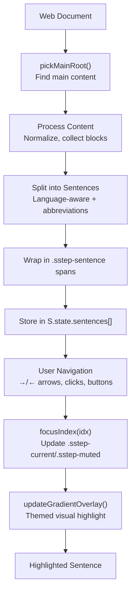

# Sentence Stepper


An HTML document sentence indexer and highlighter, that allows you to focus on your reading by highlighting one sentence at a time, and dimming all distractions. 

<div align="center">

### Chrome Extension
[](https://chromewebstore.google.com/detail/sentence-stepper/cfiappnihemjkaaepefjfofagcobikek)

### Firefox Add-on
[](https://addons.mozilla.org/en-US/firefox/addon/sentence-stepper/)

</div>


## Overall structure




## background.js

**background.js** is the script called by `manifest.json` and it serves only as a manager for the rest of the code. It is designed to follow the service worker model specified in [Manifest V3](https://developer.chrome.com/docs/extensions/develop/migrate/to-service-workers)

Listens for the click of the extension icon:

```js
// Handler for the click icon extension action.
chrome.action.onClicked.addListener(async (tab) => {...}

// Check if tab has HTTP/HTTPS url.
if (!tab || !tab.id || !/^https?:/i.test(tab.url || "")) return;

```

The extension toggles when the button is pressed:

```js
let toggle = null;

  try {

    const [res] = await chrome.scripting.executeScript({
      target: { tabId: tab.id },
      func: () => {...
      // Case 1: Off -> On
      // Case 2: On -> Off
      // Case 3: Injected -> Activate
      }
    });

    toggle = res && res.result;

  } catch (e) { } // Fails quietly.

  if (toggle && (toggle.state === "turned-off" || toggle.state === "turned-on")) return;
```

The rest of the scripts specifies the order files and scripts need to be injected in. They are separated into `cssFiles` and `files`, and are loaded sequentially:

```js
 const cssFiles = [...]
 try {
	  for (const csss of cssFiles) {
		  await chrome.scripting.insertCSS({target: {
		  tabID: tab.id }, files: [css] });
		}
	} catch (e) {}

const files = [...]
for (const f of files) {
	await chrome.scripting.executeScript({ tagret: {
	tabID: tab.id }, files: [f] });
}
```

All that's left is to activate Sentence Stepper:

```js
await chrome.scripting.executeScript({
	target: { tabID: tab.id },
	func: () => {
		const S = window.SStep;
		if (!S) return;
		
		try {...} // Mount Toolbar
		try {...} // Apply highlight and dimming effect.
		catch (e) {}
	}
});
```
## utils.js

Sets the variables for `window.SStep`, includes helpers for splitting sentences. 

```js

S.state = {
	sentences: [],
	current: 0;
	enabled: false;
	overlayEl: null;
	overlayRaf: 0;
	lastTextPaintIndex: -1;
}

```


```js
S.escapeForCharClass = function (s) {
	return s.replace(/[-\\^\}}/g, "\\$&")
}
```

## language.js

Includes logic for language profiles, inferring language from previous selection, as well as english specific logic for recognizing non sentence terminating period usage. Purely declarative.

```js
S.LANG_PROFILES = {...}
```

```js
  function isEnglishNonTerminal(prevSlice, nextSlice) {...}
```

Defines behavior for dots that do not appear at the end of sentences by calling helper functions. Here's an example such a function and the regular expression explanation:

```js
  function looksLikeEnglishAcronym(s) { return /(?:\b[A-Za-z]\.){2,}\s*$/.test(s) || /\b[A-Za-z]\.[A-Za-z]\.[A-Za-z]?\.?\s*$/.test(s); }
```

Tests two 
* start of word `\b` with a single letter, followed by a dot, which repeats at least 2 `times(?:...){2,}`, with optional white space `\s*$`
* start of word with at least two letters followed by a period, an optional third letter, and an optional period.

Similar kind of logic for other languages would be appreciated!

(more on regular expressions: https://regex101.com/)
## dom.js

Picks main content to read, and ignores supplementary information. Wraps the content in a span so that the rest of the code can manipulate it. 

```js
S.pickMainRoot() = function pickMainRoot() {
	const candidates = [
	"#mw-content-text",            //Wikipedia
	"...",
	"main",                        //HTML5 main
	"article",                     //HTML5 article
	"#content",
	".content",
	".post",
	".entry",
	".article-body",
	".story-body",
	".post-content"
	]
	
	// If many of the above candidates are present, text length is used to determine which is likely to contain the main content.
	const byLen = el => (el.innerText || "").trim().length;
	let best = candidates.sort((a,b)=>byLen(b)-bylen(a))[0];
	
}
```

The following functions constitue content detection. Text detection utilizes the TreeWalker API. It filters out non-main content, as well as short text elements and code blocks/scripts/etc.

```js
// Content block detection
S.collectBlocks = function collectBlocks(root, startAt) {
	const blockSel = "p, li, dd, blockquote";
	...
}

// Text node detection within a block
S.collectTextNodesIn = function collectTextNodesIn(block) {
	const walker = document.createTreeWalker(block, NodeFilter.SHOW_TEXT, {
	...
	});
	const out = [];
	while (walker.nextNode()) out.push(walker.currentNode);
	return out;
}
```

Next a character-level index of all the text is created.

```js
buildIndexMao()
findPox()
```


## overlay.js

Specifies themes, saves preference to `localStorage`, and adds styling to the marked span.

```js
const S = (window.SStep = window.SStep || {});
const ST = S.state; // State object.
```

```js
S.THEMES = [...]

S.ensureOverlay = function ensureOverlay() {...
	...// Creates persistent overlay.
	document.body.appendChild(ST.overlayEl);	
};
S.clearOverlay = function clearOverlay() {...
	...// Clears existing overlay, since its positioned absolutely.
	ST.overlayEl.replaceChildren();
};
```

Text position utility functions. 

```js
function caretStartAt(x, y) {
// Get text caret position from screen coordinates.
    if (document.caretRangeFromPoint) {
      const r = document.caretRangeFromPoint(x, y);
      return r ? { node: r.startContainer, offset: r.startOffset } : null;
      ...
}

function rangeBetweenPoints(x1, y1, x2, y2) {
    const s = caretStartAt(x1, y1), e = caretStartAt(x2, y2);
    if (!s || !e) return null;
    
    const r = document.createRange();
    try { 
      r.setStart(s.node, s.offset); 
      r.setEnd(e.node, e.offset); 
      return r.collapsed ? null : r; 
    }
    catch { 
      return null;  // Silently fails.
    }
  }

```

Below is specific to gradient overlay themes.

```js
S.updateGradientOverlay = function updateGradientOverlay() {
...

	for (const rc of rects) {
	
		if (isSpanBg) {...}
		
		if (isTextSpan) {...}
	}
	

}
```

Copying typographic elements from the original CSS and adding them to the cloned text that is to be highlighted. Contains special handling for justified text.

```js

	const cs = getComputedStyle(curSpan);
	wrap.style.font = cs.font;
	wrap.style.letterSpacing = cs.letterSpacing;
	wrap.style.wordSpacing = cs.wordSpacing;
	
	// Copy line-height
	if (cs.lineHeight && cs.lineHeight !== "normal") {
		wrap.style.lineHeight = cs.lineHeight;
	}
	
	// Support for RTL text.
	wrap.style.direction = cs.direction;
	wrap.style.hyphens - cs.hyphens;
	wrap.style.textAlign = cs.textAlign;

	// For justified text.
	if (cs.textAlign.includes("justify")) {
          wrap.style.textJustify = "inter-word";
    }
    
    // Add cloned text to overlay.
    wrap.appendChild(frag);
    ov.appendChild(wrap);
    
```

Schedules an overlay updated for animation frame.

```js

S.scheduleOverlayUpdate = function scheduleOverlayUpdate() {
	cancelAnimationFrame(ST.overlayRaf);
	ST.overlayRaf = requestAnimationFrame(S.updateGradientOverlay);
};

```

And finally, event listeners:

```js
document.addEventListener("sstep:colorsChanged", () => {
    S.scheduleOverlayUpdate && S.scheduleOverlayUpdate();
  });
```

## main.js

Key orchestrator of all other features. 

Features are defined in the `features` directory.

```js

const S = (window.SStep = window.SStep || {});
const ST = S.state || (S.state = { current: 0; sentences: []}); // Initialize default values.

S.applyEffect = async function () 
	if (ST.enabled) return; // Idempotent
	
	S.Spans?.buildIfNeeded();
	if (!ST.sentences.length) return;
	
	ST.enabled = true; 
	
	// Features
	S.Hotkeys?.init({ onNext: S.next, onPrev: S.prev });
	S.Hotkeys?.attach();
	
	S.ClickJump?.attach(S.rootEl || document.body);
	
	if (S.Bookmark?.maybeRestore) {
		try {
			await S.Bookmark.maybeRestore();
		} catch { }
	}
	
	S.focusIndex(ST.current, { scroll: true });
	S.WhatsNew?.maybeShow();
};

S.removeEffect = function (keepPlace = true) {...
	// Undoes all that was done on the previous function.
};

```

Navigation system

```js
// Focuses on the sentence specified in the index.
S.focusIndex = function(i, opts = {}) {
	if (!ST.sentences.length) return; // No sentences
	const clamp = ...
	ST.current = ...
	
	ST.sentences.forEach(s => s.classList.remove
	("sttep-current", "sttep-muted")); 
	if (!ST.enabled) return;
	
	const cur = ST.sentences[ST.current];
	cur.classList.add("sstep-current"); // Highlights current sentences.
	ST.sentences.forEach((s, idx) => {
		if (idx !== ST.current) s.classList.add("sstep-muted");
	});
	
	...
	
	const text = (cur.textContent || "").replace(/\s+/g, " ").trim(); // Fix whitespaces.
	
	...
}

S.next = () => S.focusIndex((ST.current || 0) + 1);
S.prev = () => S.focusIndex((ST.current || 0) - 1);

// Overlay updates.
const schedule = () => S.scheduleOverlayUpdate && S.scheduleOverlayUpdate();
window.addEventListener("scroll", schedule, { passive: true });
window.addEventListener("resize", schedule);
S.addToolbar && S.addToolbar();
...

```


---

# PDF Support

I believe a good basis for the project can be the [Hypothesis](https://github.com/hypothesis/browser-extension) extension. 

* Extension logic: https://github.com/hypothesis/browser-extension/tree/main
* Client: https://github.com/hypothesis/client/tree/main/src

There seem to be two main components to how Hypothesis deals with pdfs: `pdf.js` in the extension repo, and `pdf.ts` in the client repo.

```txt
browser-extension repo
│
├── detects content type
├── decides injection strategy
├── loads client bundle
│
└── client repo
     ├── inspects DOM
     ├── reads PDF text layer
     ├── anchors highlights
     └── draws overlays

```

**Tangential**, but the way the extension and the client are separated is kind of interesting and the way the connection is made from browser-extension repo to the client repo is worth investigating. Since the extension repo is just a wrapper for the client repo, it has to be linked somewhere.

The client repository needs to be built beforehand and 

```txt
yarn link ../client
```

```json
"web_accessible_resources": [
    {
      "resources": [
        "client/*",
        "help/*",
        "pdfjs/*",
        "pdfjs/web/viewer.html"
      ],
      "matches": ["<all_urls>"]
    }
  ]
```


Below is some relevant snippets and annotated code from both repos that could be useful in developing PDF support for Sentence Stepper:


```ts
// browser-extension/src/background/detect-content-type.ts

export type PDFContentType = { type: 'PDF' };

export type HTMLContentType = { type: 'HTML' };

export type ContentTypeInfo = PDFContentType | HTMLContentType;

... function detectChromePDFViewer(): PDFContentType | null {...}

 // When viewing a PDF in Chrome, the viewer consists of a top-level
    // document with an <embed> tag, which in turn instantiates an inner HTML
    // document providing the PDF viewer UI plus another <embed> tag which
    // instantiates the native PDF renderer.
    //
    // The selector below matches the <embed> tag in the top-level document. To
    // see this document, open the developer tools from Chrome's menu rather
    // than right-clicking on the viewport and selecting the 'Inspect' option
    // which will instead show the _inner_ document.

... function detectFirefoxPDFViewer(): PDFContentType | null {...}

// The Firefox PDF viewer is an instance of PDF.js.
   //
    // The Firefox PDF plugin specifically can be detected via the <base>
    // tag it includes, which can be done from a content script (which runs
    // in an isolated JS world from the page's own scripts).
    //
    // Generic PDF.js detection can be done by looking for the
    // `window.PDFViewerApplication` object. This however requires running JS
    // code in the same JS context as the page's own code.

```

**Tangential**, but it would probably be useful to include something like this as well. 

```ts
// browser-extension/src/background/url-info.ts

const BLOCKED_HOSTNAMES = new Set([
	'facebook.com',
	'www.facebook.com',
	'mail.google.com',
]);

```

```ts
// client/src/anchoring/pdf.ts

...
import type {
  PDFPageProxy,
  PDFPageView,
  PDFViewer,
  TextLayer,
} from '../../types/pdfjs';
...

// !Get the PDF.js viewer application.
function getPDFViewer(): PDFViewer {
  // @ts-ignore - TS doesn't know about PDFViewerApplication global.
  return PDFViewerApplication.pdfViewer;
}

```


---
# ePUB Support

* https://kitaboo.com/epub-js-vs-readium-js-comparison-of-epub-readers/
* https://github.com/futurepress/epub.js

